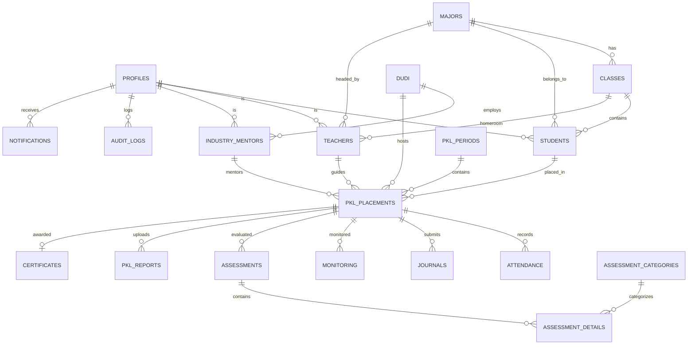

# DOKUMEN ANALISIS & DESAIN SISTEM (PHASE 0)
# E-PKL NSC — SISTEM INFORMASI PRAKTIK KERJA LAPANGAN
**SMK Negeri 1 Cilamaya**

---

## 1. ARSITEKTUR APLIKASI E-PKL NSC

Aplikasi **E-PKL NSC** dirancang menggunakan arsitektur modern berbasis **Single Page Application (SPA)** yang terintegrasi dengan **Backend-as-a-Service (BaaS) Supabase**.

```
+-------------------------------------------------------------------------------+
|                                FRONTEND LAYER                                 |
|   React 18 + Vite + TypeScript + Tailwind CSS + Lucide React + Recharts        |
+---------------------------------------+---------------------------------------+
                                        | (HTTPS / WSS / REST / RPC)
                                        v
+-------------------------------------------------------------------------------+
|                            SECURITY & ACCESS GATE                             |
|      Supabase Auth (JWT) + RBAC Middleware + App-Level Permission Guards      |
+---------------------------------------+---------------------------------------+
                                        |
                                        v
+-------------------------------------------------------------------------------+
|                            SERVICE / REPOSITORY LAYER                         |
|   authService | studentService | pklService | journalService | reportService  |
+---------------------------------------+---------------------------------------+
                                        |
         +------------------------------+------------------------------+
         |                                                             |
         v                                                             v
+----------------------------------+          +---------------------------------+
|      SUPABASE POSTGRESQL DB      |          |        SUPABASE STORAGE         |
|  - 22 Relational Tables          |          |  - student-photos               |
|  - Row Level Security (RLS)      |          |  - journal-documents            |
|  - Triggers & Stored Procedures  |          |  - monitoring-documents         |
|  - Audit Log Tracking            |          |  - pkl-reports                  |
|  - Realtime Change Subscriptions |          |  - certificates                 |
+----------------------------------+          |  - school-assets                |
                                              +---------------------------------+
```

### Prinsip Arsitektur:
1. **Separation of Concerns:** Pemisahan tegas antara UI Component, State Management/Hooks, Data Service Layer, dan Database.
2. **Strict Type Safety:** Seluruh payload API, entitas database, dan props UI didefinisikan secara eksplisit menggunakan TypeScript Interfaces.
3. **Defense in Depth Security:** Otorisasi diterapkan di dua lapis — Frontend (Conditional UI & Route Guards) dan Database (PostgreSQL Row Level Security / RLS).
4. **Resilient Data Access:** Akses data dienkapsulasi dalam modular services dengan unified error handler yang menghasilkan user-friendly toast feedback.

---

## 2. ENTITY RELATIONSHIP DIAGRAM (ERD)



---

## 3. DAFTAR LENGKAP 22 TABEL SUPABASE (POSTGRESQL)

| No | Nama Tabel | Deskripsi & Fungsi |
|---|---|---|
| 1 | `profiles` | Data profil pengguna terhubung dengan `auth.users`, menyimpan role dan metadata akun. |
| 2 | `majors` | Data master program keahlian / jurusan di SMKN 1 Cilamaya. |
| 3 | `classes` | Data master rombongan belajar / kelas beserta tingkat dan wali kelas. |
| 4 | `teachers` | Data master guru pembimbing dan koordinator PKL. |
| 5 | `students` | Data master siswa peserta PKL. |
| 6 | `dudi` | Data master Dunia Usaha / Dunia Industri mitra PKL dan kuota penerimaan. |
| 7 | `industry_mentors` | Data pembimbing lapangan dari pihak instansi / industri DUDI. |
| 8 | `pkl_periods` | Data master gelombang / tahun ajaran periode pelaksanaan PKL. |
| 9 | `pkl_placements` | Tabel penghubung utama penempatan siswa di DUDI dengan guru & pembimbing industri. |
| 10 | `attendance` | Log absensi harian siswa PKL (jam masuk, pulang, status, koordinat GPS, foto selfie). |
| 11 | `journals` | Catatan jurnal harian kegiatan PKL, kompetensi, dokumentasi, dan verifikasi guru. |
| 12 | `monitoring` | Catatan kunjungan monitoring guru pembimbing ke tempat PKL DUDI. |
| 13 | `assessment_categories` | Rubrik aspek dan kriteria penilaian (aspek industri dan aspek guru). |
| 14 | `assessments` | Header nilai akhir PKL gabungan nilai industri dan nilai guru pembimbing. |
| 15 | `assessment_details` | Rincian skor per butir indikator penilaian kompetensi dan sikap. |
| 16 | `pkl_reports` | Pengumpulan file naskah laporan akhir PKL dan riwayat revisi pembimbing. |
| 17 | `documents` | Template dan arsip surat resmi (surat tugas, pengantar, permohonan, penarikan). |
| 18 | `certificates` | Data penerbitan sertifikat digital PKL lengkap dengan nomor seri dan kode QR verifikasi. |
| 19 | `announcements` | Pengumuman broadcast dari admin dengan target audiens spesifik. |
| 20 | `notifications` | Notifikasi in-app real-time untuk user terkait status jurnal, revisi, dan penilaian. |
| 21 | `settings` | Konfigurasi sistem dinamis (bobot nilai, toleransi GPS, batas monitoring, kontak sekolah). |
| 22 | `audit_logs` | Catatan rekam jejak aktivitas kritis pengguna demi keamanan dan akuntabilitas sistem. |

---

## 4. FIELD SPESIFIKASI SETIAP TABEL

### 1. `profiles`
* `id`: `UUID PRIMARY KEY REFERENCES auth.users(id) ON DELETE CASCADE`
* `name`: `VARCHAR(150) NOT NULL`
* `email`: `VARCHAR(150) UNIQUE NOT NULL`
* `role`: `VARCHAR(30) NOT NULL CHECK (role IN ('super_admin', 'admin_pkl', 'kepala_sekolah', 'wakasek', 'guru_pembimbing', 'siswa', 'pembimbing_industri'))`
* `avatar_url`: `TEXT`
* `phone_number`: `VARCHAR(25)`
* `is_active`: `BOOLEAN DEFAULT true`
* `created_at`: `TIMESTAMPTZ DEFAULT now()`
* `updated_at`: `TIMESTAMPTZ DEFAULT now()`

### 2. `majors`
* `id`: `UUID PRIMARY KEY DEFAULT gen_random_uuid()`
* `code`: `VARCHAR(20) UNIQUE NOT NULL` (Contoh: TKRO, TP, TKJ, APAT, APHP)
* `name`: `VARCHAR(100) NOT NULL`
* `head_teacher_id`: `UUID REFERENCES teachers(id) ON DELETE SET NULL`
* `status`: `VARCHAR(20) DEFAULT 'active'`
* `created_at`: `TIMESTAMPTZ DEFAULT now()`
* `updated_at`: `TIMESTAMPTZ DEFAULT now()`

### 3. `classes`
* `id`: `UUID PRIMARY KEY DEFAULT gen_random_uuid()`
* `name`: `VARCHAR(50) NOT NULL` (Contoh: XI TKJ 1, XII TKRO 2)
* `grade_level`: `INT NOT NULL CHECK (grade_level IN (10, 11, 12, 13))`
* `major_id`: `UUID NOT NULL REFERENCES majors(id) ON DELETE RESTRICT`
* `homeroom_teacher_id`: `UUID REFERENCES teachers(id) ON DELETE SET NULL`
* `academic_year`: `VARCHAR(20) NOT NULL` (Contoh: 2026/2027)
* `status`: `VARCHAR(20) DEFAULT 'active'`
* `created_at`: `TIMESTAMPTZ DEFAULT now()`
* `updated_at`: `TIMESTAMPTZ DEFAULT now()`

### 4. `teachers`
* `id`: `UUID PRIMARY KEY DEFAULT gen_random_uuid()`
* `user_id`: `UUID UNIQUE REFERENCES profiles(id) ON DELETE SET NULL`
* `nip`: `VARCHAR(30) UNIQUE`
* `name`: `VARCHAR(150) NOT NULL`
* `gender`: `VARCHAR(10) CHECK (gender IN ('L', 'P'))`
* `email`: `VARCHAR(150)`
* `phone_number`: `VARCHAR(25)`
* `major_id`: `UUID REFERENCES majors(id) ON DELETE SET NULL`
* `status`: `VARCHAR(20) DEFAULT 'active'`
* `created_at`: `TIMESTAMPTZ DEFAULT now()`
* `updated_at`: `TIMESTAMPTZ DEFAULT now()`

### 5. `students`
* `id`: `UUID PRIMARY KEY DEFAULT gen_random_uuid()`
* `user_id`: `UUID UNIQUE REFERENCES profiles(id) ON DELETE SET NULL`
* `nis`: `VARCHAR(30) UNIQUE NOT NULL`
* `nisn`: `VARCHAR(30) UNIQUE NOT NULL`
* `name`: `VARCHAR(150) NOT NULL`
* `gender`: `VARCHAR(10) NOT NULL CHECK (gender IN ('L', 'P'))`
* `class_id`: `UUID NOT NULL REFERENCES classes(id) ON DELETE RESTRICT`
* `major_id`: `UUID NOT NULL REFERENCES majors(id) ON DELETE RESTRICT`
* `phone_number`: `VARCHAR(25)`
* `email`: `VARCHAR(150)`
* `address`: `TEXT`
* `parent_name`: `VARCHAR(150)`
* `parent_phone`: `VARCHAR(25)`
* `status`: `VARCHAR(25) DEFAULT 'eligible' CHECK (status IN ('eligible', 'placed', 'ongoing', 'completed', 'inactive'))`
* `photo_url`: `TEXT`
* `created_at`: `TIMESTAMPTZ DEFAULT now()`
* `updated_at`: `TIMESTAMPTZ DEFAULT now()`

### 6. `dudi`
* `id`: `UUID PRIMARY KEY DEFAULT gen_random_uuid()`
* `name`: `VARCHAR(200) NOT NULL`
* `business_sector`: `VARCHAR(100) NOT NULL`
* `address`: `TEXT NOT NULL`
* `village`: `VARCHAR(100)`
* `district`: `VARCHAR(100)`
* `city_regency`: `VARCHAR(100) DEFAULT 'Karawang'`
* `province`: `VARCHAR(100) DEFAULT 'Jawa Barat'`
* `latitude`: `DECIMAL(10, 8)`
* `longitude`: `DECIMAL(11, 8)`
* `radius_meters`: `INT DEFAULT 100`
* `director_name`: `VARCHAR(150)`
* `contact_person`: `VARCHAR(150)`
* `phone_number`: `VARCHAR(25)`
* `email`: `VARCHAR(150)`
* `quota`: `INT DEFAULT 5`
* `status`: `VARCHAR(20) DEFAULT 'active' CHECK (status IN ('active', 'inactive', 'mou_pending', 'full'))`
* `notes`: `TEXT`
* `created_at`: `TIMESTAMPTZ DEFAULT now()`
* `updated_at`: `TIMESTAMPTZ DEFAULT now()`

### 7. `industry_mentors`
* `id`: `UUID PRIMARY KEY DEFAULT gen_random_uuid()`
* `user_id`: `UUID UNIQUE REFERENCES profiles(id) ON DELETE SET NULL`
* `dudi_id`: `UUID NOT NULL REFERENCES dudi(id) ON DELETE CASCADE`
* `name`: `VARCHAR(150) NOT NULL`
* `position`: `VARCHAR(100)`
* `phone_number`: `VARCHAR(25)`
* `email`: `VARCHAR(150)`
* `status`: `VARCHAR(20) DEFAULT 'active'`
* `created_at`: `TIMESTAMPTZ DEFAULT now()`
* `updated_at`: `TIMESTAMPTZ DEFAULT now()`

### 8. `pkl_periods`
* `id`: `UUID PRIMARY KEY DEFAULT gen_random_uuid()`
* `academic_year`: `VARCHAR(20) NOT NULL` (Contoh: 2026/2027)
* `name`: `VARCHAR(100) NOT NULL` (Contoh: PKL Gelombang 1 Ganjil)
* `start_date`: `DATE NOT NULL`
* `end_date`: `DATE NOT NULL`
* `is_active`: `BOOLEAN DEFAULT true`
* `status`: `VARCHAR(20) DEFAULT 'open' CHECK (status IN ('planned', 'open', 'ongoing', 'completed', 'archived'))`
* `created_at`: `TIMESTAMPTZ DEFAULT now()`
* `updated_at`: `TIMESTAMPTZ DEFAULT now()`

### 9. `pkl_placements`
* `id`: `UUID PRIMARY KEY DEFAULT gen_random_uuid()`
* `period_id`: `UUID NOT NULL REFERENCES pkl_periods(id) ON DELETE RESTRICT`
* `student_id`: `UUID NOT NULL REFERENCES students(id) ON DELETE RESTRICT`
* `dudi_id`: `UUID NOT NULL REFERENCES dudi(id) ON DELETE RESTRICT`
* `teacher_id`: `UUID REFERENCES teachers(id) ON DELETE SET NULL`
* `industry_mentor_id`: `UUID REFERENCES industry_mentors(id) ON DELETE SET NULL`
* `start_date`: `DATE NOT NULL`
* `end_date`: `DATE NOT NULL`
* `position_department`: `VARCHAR(100)`
* `status`: `VARCHAR(25) DEFAULT 'not_started' CHECK (status IN ('not_started', 'active', 'completed', 'cancelled', 'withdrawn'))`
* `notes`: `TEXT`
* `created_at`: `TIMESTAMPTZ DEFAULT now()`
* `updated_at`: `TIMESTAMPTZ DEFAULT now()`
* `CONSTRAINT uq_student_period UNIQUE (student_id, period_id)`

### 10. `attendance`
* `id`: `UUID PRIMARY KEY DEFAULT gen_random_uuid()`
* `placement_id`: `UUID NOT NULL REFERENCES pkl_placements(id) ON DELETE CASCADE`
* `student_id`: `UUID NOT NULL REFERENCES students(id) ON DELETE CASCADE`
* `date`: `DATE NOT NULL`
* `check_in_time`: `TIME`
* `check_out_time`: `TIME`
* `status`: `VARCHAR(20) NOT NULL CHECK (status IN ('hadir', 'izin', 'sakit', 'alpa', 'libur'))`
* `latitude`: `DECIMAL(10, 8)`
* `longitude`: `DECIMAL(11, 8)`
* `is_location_valid`: `BOOLEAN DEFAULT true`
* `photo_url`: `TEXT`
* `notes`: `TEXT`
* `verified_by`: `UUID REFERENCES profiles(id) ON DELETE SET NULL`
* `created_at`: `TIMESTAMPTZ DEFAULT now()`
* `updated_at`: `TIMESTAMPTZ DEFAULT now()`
* `CONSTRAINT uq_student_attendance_date UNIQUE (student_id, date)`

### 11. `journals`
* `id`: `UUID PRIMARY KEY DEFAULT gen_random_uuid()`
* `placement_id`: `UUID NOT NULL REFERENCES pkl_placements(id) ON DELETE CASCADE`
* `student_id`: `UUID NOT NULL REFERENCES students(id) ON DELETE CASCADE`
* `date`: `DATE NOT NULL`
* `activity_title`: `VARCHAR(200) NOT NULL`
* `activity_description`: `TEXT NOT NULL`
* `competency_applied`: `TEXT`
* `duration_hours`: `DECIMAL(4, 2) DEFAULT 8.0`
* `problems_faced`: `TEXT`
* `solutions_applied`: `TEXT`
* `documentation_url`: `TEXT`
* `status`: `VARCHAR(20) DEFAULT 'draft' CHECK (status IN ('draft', 'submitted', 'approved', 'revision_required'))`
* `teacher_notes`: `TEXT`
* `mentor_notes`: `TEXT`
* `verified_at`: `TIMESTAMPTZ`
* `verified_by`: `UUID REFERENCES profiles(id) ON DELETE SET NULL`
* `created_at`: `TIMESTAMPTZ DEFAULT now()`
* `updated_at`: `TIMESTAMPTZ DEFAULT now()`
* `CONSTRAINT uq_student_journal_date UNIQUE (student_id, date)`

### 12. `monitoring`
* `id`: `UUID PRIMARY KEY DEFAULT gen_random_uuid()`
* `placement_id`: `UUID NOT NULL REFERENCES pkl_placements(id) ON DELETE CASCADE`
* `teacher_id`: `UUID NOT NULL REFERENCES teachers(id) ON DELETE RESTRICT`
* `monitoring_stage`: `INT NOT NULL CHECK (monitoring_stage IN (1, 2, 3, 4))`
* `visit_date`: `DATE NOT NULL`
* `attendance_evaluation`: `VARCHAR(20) CHECK (attendance_evaluation IN ('sangat_baik', 'baik', 'cukup', 'kurang'))`
* `discipline_score`: `INT CHECK (discipline_score BETWEEN 0 AND 100)`
* `attitude_score`: `INT CHECK (attitude_score BETWEEN 0 AND 100)`
* `competency_score`: `INT CHECK (competency_score BETWEEN 0 AND 100)`
* `communication_score`: `INT CHECK (communication_score BETWEEN 0 AND 100)`
* `student_condition_notes`: `TEXT`
* `industry_feedback`: `TEXT`
* `problems_faced`: `TEXT`
* `teacher_recommendation`: `TEXT`
* `documentation_url`: `TEXT`
* `created_at`: `TIMESTAMPTZ DEFAULT now()`
* `updated_at`: `TIMESTAMPTZ DEFAULT now()`

### 13. `assessment_categories`
* `id`: `UUID PRIMARY KEY DEFAULT gen_random_uuid()`
* `evaluator_type`: `VARCHAR(20) NOT NULL CHECK (evaluator_type IN ('industry', 'teacher'))`
* `code`: `VARCHAR(30) NOT NULL`
* `name`: `VARCHAR(150) NOT NULL`
* `description`: `TEXT`
* `default_weight`: `DECIMAL(5, 2) NOT NULL DEFAULT 10.0`
* `order_index`: `INT DEFAULT 1`
* `is_active`: `BOOLEAN DEFAULT true`
* `created_at`: `TIMESTAMPTZ DEFAULT now()`

### 14. `assessments`
* `id`: `UUID PRIMARY KEY DEFAULT gen_random_uuid()`
* `placement_id`: `UUID UNIQUE NOT NULL REFERENCES pkl_placements(id) ON DELETE CASCADE`
* `industry_score`: `DECIMAL(5, 2)`
* `industry_weight`: `DECIMAL(5, 2) DEFAULT 40.0`
* `industry_evaluated_by`: `UUID REFERENCES industry_mentors(id) ON DELETE SET NULL`
* `industry_evaluated_at`: `TIMESTAMPTZ`
* `teacher_score`: `DECIMAL(5, 2)`
* `teacher_weight`: `DECIMAL(5, 2) DEFAULT 60.0`
* `teacher_evaluated_by`: `UUID REFERENCES teachers(id) ON DELETE SET NULL`
* `teacher_evaluated_at`: `TIMESTAMPTZ`
* `final_score`: `DECIMAL(5, 2)`
* `predicate`: `VARCHAR(5) CHECK (predicate IN ('A', 'B', 'C', 'D'))`
* `status`: `VARCHAR(20) DEFAULT 'draft' CHECK (status IN ('draft', 'partial', 'completed', 'published'))`
* `created_at`: `TIMESTAMPTZ DEFAULT now()`
* `updated_at`: `TIMESTAMPTZ DEFAULT now()`

### 15. `assessment_details`
* `id`: `UUID PRIMARY KEY DEFAULT gen_random_uuid()`
* `assessment_id`: `UUID NOT NULL REFERENCES assessments(id) ON DELETE CASCADE`
* `category_id`: `UUID NOT NULL REFERENCES assessment_categories(id) ON DELETE RESTRICT`
* `score`: `DECIMAL(5, 2) NOT NULL CHECK (score BETWEEN 0 AND 100)`
* `notes`: `TEXT`
* `created_at`: `TIMESTAMPTZ DEFAULT now()`

### 16. `pkl_reports`
* `id`: `UUID PRIMARY KEY DEFAULT gen_random_uuid()`
* `placement_id`: `UUID NOT NULL REFERENCES pkl_placements(id) ON DELETE CASCADE`
* `student_id`: `UUID NOT NULL REFERENCES students(id) ON DELETE CASCADE`
* `title`: `VARCHAR(255) NOT NULL`
* `abstract`: `TEXT`
* `file_url`: `TEXT NOT NULL`
* `file_size_bytes`: `BIGINT`
* `version`: `INT DEFAULT 1`
* `status`: `VARCHAR(20) DEFAULT 'draft' CHECK (status IN ('draft', 'submitted', 'in_review', 'revision_required', 'approved'))`
* `teacher_feedback`: `TEXT`
* `reviewed_by`: `UUID REFERENCES teachers(id) ON DELETE SET NULL`
* `approved_at`: `TIMESTAMPTZ`
* `created_at`: `TIMESTAMPTZ DEFAULT now()`
* `updated_at`: `TIMESTAMPTZ DEFAULT now()`

### 17. `documents`
* `id`: `UUID PRIMARY KEY DEFAULT gen_random_uuid()`
* `code`: `VARCHAR(50) UNIQUE NOT NULL` (Contoh: SURAT-PENGANTAR, SURAT-TUGAS)
* `title`: `VARCHAR(200) NOT NULL`
* `type`: `VARCHAR(50) NOT NULL CHECK (type IN ('surat_pengantar', 'surat_permohonan', 'surat_tugas', 'surat_penerimaan', 'surat_monitoring', 'surat_selesai'))`
* `template_body`: `TEXT NOT NULL`
* `variables_json`: `JSONB`
* `header_image_url`: `TEXT`
* `footer_text`: `TEXT`
* `is_active`: `BOOLEAN DEFAULT true`
* `created_at`: `TIMESTAMPTZ DEFAULT now()`
* `updated_at`: `TIMESTAMPTZ DEFAULT now()`

### 18. `certificates`
* `id`: `UUID PRIMARY KEY DEFAULT gen_random_uuid()`
* `placement_id`: `UUID UNIQUE NOT NULL REFERENCES pkl_placements(id) ON DELETE CASCADE`
* `student_id`: `UUID NOT NULL REFERENCES students(id) ON DELETE CASCADE`
* `certificate_number`: `VARCHAR(100) UNIQUE NOT NULL` (Contoh: PKL-2026-00001)
* `issue_date`: `DATE NOT NULL`
* `principal_name`: `VARCHAR(150) NOT NULL`
* `principal_nip`: `VARCHAR(50)`
* `final_score`: `DECIMAL(5, 2) NOT NULL`
* `predicate`: `VARCHAR(5) NOT NULL`
* `verification_code`: `VARCHAR(64) UNIQUE NOT NULL`
* `pdf_url`: `TEXT`
* `qr_code_url`: `TEXT`
* `status`: `VARCHAR(20) DEFAULT 'valid' CHECK (status IN ('draft', 'valid', 'revoked'))`
* `created_at`: `TIMESTAMPTZ DEFAULT now()`
* `updated_at`: `TIMESTAMPTZ DEFAULT now()`

### 19. `announcements`
* `id`: `UUID PRIMARY KEY DEFAULT gen_random_uuid()`
* `title`: `VARCHAR(200) NOT NULL`
* `content`: `TEXT NOT NULL`
* `target_role`: `VARCHAR(30) DEFAULT 'all'`
* `target_major_id`: `UUID REFERENCES majors(id) ON DELETE CASCADE`
* `target_class_id`: `UUID REFERENCES classes(id) ON DELETE CASCADE`
* `attachment_url`: `TEXT`
* `is_pinned`: `BOOLEAN DEFAULT false`
* `author_id`: `UUID NOT NULL REFERENCES profiles(id) ON DELETE CASCADE`
* `published_at`: `TIMESTAMPTZ DEFAULT now()`
* `expires_at`: `TIMESTAMPTZ`
* `created_at`: `TIMESTAMPTZ DEFAULT now()`

### 20. `notifications`
* `id`: `UUID PRIMARY KEY DEFAULT gen_random_uuid()`
* `user_id`: `UUID NOT NULL REFERENCES profiles(id) ON DELETE CASCADE`
* `title`: `VARCHAR(150) NOT NULL`
* `message`: `TEXT NOT NULL`
* `type`: `VARCHAR(30) DEFAULT 'info' CHECK (type IN ('info', 'warning', 'success', 'error', 'journal', 'attendance', 'monitoring', 'assessment', 'report'))`
* `action_url`: `TEXT`
* `is_read`: `BOOLEAN DEFAULT false`
* `created_at`: `TIMESTAMPTZ DEFAULT now()`

### 21. `settings`
* `key`: `VARCHAR(100) PRIMARY KEY`
* `value`: `JSONB NOT NULL`
* `description`: `TEXT`
* `updated_by`: `UUID REFERENCES profiles(id) ON DELETE SET NULL`
* `updated_at`: `TIMESTAMPTZ DEFAULT now()`

### 22. `audit_logs`
* `id`: `UUID PRIMARY KEY DEFAULT gen_random_uuid()`
* `user_id`: `UUID REFERENCES profiles(id) ON DELETE SET NULL`
* `action`: `VARCHAR(50) NOT NULL` (Contoh: LOGIN, CREATE, UPDATE, DELETE, VERIFY, ASSESS, GENERATE_CERT)
* `resource`: `VARCHAR(50) NOT NULL` (Contoh: Placements, Journals, Assessments)
* `record_id`: `VARCHAR(100)`
* `details`: `JSONB`
* `ip_address`: `VARCHAR(45)`
* `user_agent`: `TEXT`
* `created_at`: `TIMESTAMPTZ DEFAULT now()`

---

## 5. MATRIX ROLE & PERMISSION (RBAC 7 ROLES)

| Fitur / Modul | Super Admin | Admin PKL | Kepala Sekolah | Wakasek | Guru Pembimbing | Siswa | Pembimbing Industri |
|---|:---:|:---:|:---:|:---:|:---:|:---:|:---:|
| **Dashboard Khusus** | Full Admin | Full Admin | Eksekutif | Eksekutif | Guru | Siswa | Industri |
| **Master Data (Siswa, Guru, Jurusan, Kelas)** | CRUD | CRUD | View | View | View | - | - |
| **Master DUDI & Mitra** | CRUD | CRUD | View | View | View | View List | View Own |
| **Periode PKL** | CRUD | CRUD | View | View | View | View Active | View Active |
| **Penempatan PKL** | CRUD | CRUD | View | View | View Bimbingan | View Own | View Bimbingan |
| **Absensi PKL** | Monitor All | Monitor All | Rekap | Rekap | Verifikasi & Rekap | Submit & History | Monitor DUDI |
| **Jurnal PKL** | Monitor All | Monitor All | Rekap | Rekap | Verifikasi & Review | Submit & Edit | Monitor & Note |
| **Monitoring PKL** | View All | View All | View All | View All | Create & Edit | View Hasil | View Hasil |
| **Penilaian Industri** | Monitor | Monitor | View | View | View | View Final | Input & Edit |
| **Penilaian Guru** | Monitor | Monitor | View | View | Input & Edit | View Final | View Final |
| **Nilai Akhir & Rekap** | CRUD | CRUD | View / Print | View / Print | View Bimbingan | View Own | View Bimbingan |
| **Laporan PKL** | View All | View All | View | View | Review & Approve | Upload & Revisi | View |
| **Sertifikat PKL** | Generate/Print | Generate/Print | Sign/Print | View | View | Download | - |
| **Dokumen & Surat** | Template/Print | Template/Print | View/Sign | View | Print Surat Tugas | Print Pengantar | Print Selesai |
| **Pengumuman** | CRUD Broadcast | CRUD Broadcast | View | View | View | View | View |
| **User Management** | CRUD Full | Manage User | - | - | - | - | - |
| **Pengaturan Sistem** | Full Access | Config Bobot/GPS | - | - | - | - | - |
| **Audit Logs** | View All | View All | - | - | - | - | - |

---

## 6. SITEMAP APLIKASI E-PKL NSC

```
/ (Landing Page / Redirect ke Login)
|-- /login (Autentikasi Akun Supabase)
|-- /forgot-password (Lupa Kata Sandi)
|-- /reset-password (Setel Ulang Kata Sandi)
|-- /verify/:certNumber (Verifikasi Publik Sertifikat via QR Code - No Auth)
|
+-- /app (Protected Portal dengan Role-Based Layout)
    |-- /dashboard (Auto redirect ke dashboard sesuai role)
    |   |-- /admin (Dashboard Admin & Super Admin)
    |   |-- /executive (Dashboard Kepala Sekolah & Wakasek)
    |   |-- /guru (Dashboard Guru Pembimbing)
    |   |-- /siswa (Dashboard Siswa PKL)
    |   +-- /industri (Dashboard Pembimbing Industri)
    |
    |-- /master (Admin & Super Admin)
    |   |-- /siswa
    |   |-- /guru
    |   |-- /jurusan
    |   |-- /kelas
    |   +-- /pembimbing-industri
    |
    |-- /pkl
    |   |-- /periode (Admin)
    |   |-- /dudi (Daftar Mitra Perusahaan)
    |   |-- /penempatan (Plotting Siswa - DUDI - Guru)
    |   +-- /siswa-aktif (Daftar Siswa Sedang PKL)
    |
    |-- /kegiatan
    |   |-- /absensi (Presensi Siswa + Validasi GPS & Selfie)
    |   |-- /jurnal (Logbook harian + Verifikasi Guru)
    |   +-- /monitoring (Kunjungan & Bimbingan Guru ke DUDI)
    |
    |-- /penilaian
    |   |-- /industri (Form Nilai Aspek Industri)
    |   |-- /guru (Form Nilai Aspek Guru)
    |   |-- /konfigurasi-bobot (Admin)
    |   +-- /rekap-nilai (Nilai Akhir Otomatis)
    |
    |-- /dokumen
    |   |-- /laporan-pkl (Workflow Naskah Laporan Akhir)
    |   |-- /surat-menyurat (Generator Surat Pengantar/Tugas)
    |   +-- /sertifikat (Generator & Cetak Sertifikat Digital)
    |
    |-- /laporan (Export & Print Rekapitulasi)
    |   |-- /rekap-absensi
    |   |-- /rekap-jurnal
    |   |-- /rekap-monitoring
    |   +-- /rekap-kelulusan-pkl
    |
    |-- /pengumuman (Broadcast Informasi PKL)
    |-- /notifikasi (Pusat Notifikasi User)
    |-- /users (User Management & Role Assignment)
    |-- /pengaturan (Pengaturan Umum, Bobot Nilai, Geolocation)
    +-- /audit-log (Log Keamanan & Aktivitas Sistem)
```

---

## 7. STRUKTUR FOLDER REACT / VITE + TYPESCRIPT

```
6. E-PKL/
├── public/
│   ├── favicon.ico
│   ├── logo-nsc.png
│   └── mock-assets/
├── src/
│   ├── assets/
│   │   └── images/
│   ├── components/
│   │   ├── common/             # Button, Input, Modal, Table, Badge, Dropdown, Toast, etc.
│   │   ├── layout/             # Sidebar, Topbar, ContentWrapper, MobileNav, Footer
│   │   ├── feedback/           # LoadingSpinner, EmptyState, ErrorBoundary, ConfirmDialog
│   │   ├── charts/             # Recharts wrapper components
│   │   └── forms/              # Reusable Form Controls & Field Validation
│   ├── context/
│   │   ├── AuthContext.tsx     # Supabase Auth, Session, Current Profile & Role
│   │   ├── ToastContext.tsx    # Toast Notification System
│   │   └── ThemeContext.tsx    # App Theme & Layout States
│   ├── hooks/
│   │   ├── useAuth.ts
│   │   ├── useRole.ts
│   │   ├── useGeolocation.ts   # Device GPS coordinates & distance calculator
│   │   └── useDebounce.ts
│   ├── layouts/
│   │   ├── AppLayout.tsx       # Main Shell (Sidebar + Topbar + Main Area)
│   │   ├── AuthLayout.tsx      # Clean Shell for Login & Auth Flows
│   │   └── PublicLayout.tsx    # Standalone Layout for Certificate Verification
│   ├── pages/
│   │   ├── auth/               # LoginPage, ForgotPassword, ResetPassword
│   │   ├── dashboard/          # AdminDash, ExecutiveDash, GuruDash, SiswaDash, IndustriDash
│   │   ├── master/             # StudentsPage, TeachersPage, MajorsPage, ClassesPage, MentorsPage
│   │   ├── pkl/                # PeriodsPage, DudiPage, PlacementsPage, ActiveStudentsPage
│   │   ├── activities/         # AttendancePage, JournalsPage, MonitoringPage
│   │   ├── assessment/         # IndustryAssessmentPage, TeacherAssessmentPage, FinalGradesPage
│   │   ├── documents/          # ReportsPage, OfficialLettersPage, CertificatesPage
│   │   ├── reports/            # Exportable Report Summaries (Attendance, Journals, Grades)
│   │   ├── announcements/      # AnnouncementsPage
│   │   ├── notifications/      # NotificationsCenterPage
│   │   ├── users/              # UserManagementPage
│   │   ├── settings/           # SystemSettingsPage
│   │   ├── audit/              # AuditLogsPage
│   │   ├── public/             # VerifyCertificatePage (No Auth QR scanner landing)
│   │   └── error/              # NotFoundPage (404), UnauthorizedPage (403)
│   ├── routes/
│   │   ├── AppRoutes.tsx       # Route definitions with Suspense & Lazy Loading
│   │   └── ProtectedRoute.tsx  # RBAC Route Guard by Allowed Roles
│   ├── services/
│   │   ├── supabase.ts         # Supabase Client Initialization
│   │   ├── api.ts              # Core API dispatcher & query helpers
│   │   ├── authService.ts      # Supabase Auth wrapper
│   │   ├── masterService.ts    # Student, Teacher, Major, Class, DUDI CRUD
│   │   ├── pklService.ts       # Period & Placement Services
│   │   ├── activityService.ts  # Attendance, Journal & Monitoring Services
│   │   ├── assessmentService.ts# Score calculation & Category Rubrics
│   │   ├── documentService.ts  # Report review, Letter Generation, Certificate QR
│   │   └── storageService.ts   # Supabase Storage bucket uploads & signed URLs
│   ├── types/
│   │   ├── database.types.ts   # Auto-generated Supabase PostgreSQL Schema Types
│   │   └── index.ts            # Domain Entity Types, Enums & App State Interfaces
│   ├── utils/
│   │   ├── date.ts             # Indonesian date formatting (date-fns / Intl)
│   │   ├── formatters.ts       # Currency, Grade Predicates, Phone number formatters
│   │   ├── geolocation.ts      # Haversine distance calculator for DUDI GPS geofence
│   │   ├── exportExcel.ts      # CSV / Excel export generator
│   │   └── qrCode.ts           # QR code URL generator for certificate validation
│   ├── App.tsx
│   ├── main.tsx
│   └── index.css
├── supabase/
│   ├── schema.sql              # Master SQL Schema (Tables, Constraints, Indexes)
│   ├── rls_policies.sql        # Row Level Security Policies
│   ├── triggers.sql            # Auth profile sync triggers & score calculations
│   └── seed.sql                # Initial Seed Data (Admin, Majors, Sample DUDI & Users)
├── index.html
├── package.json
├── postcss.config.js
├── tailwind.config.js
├── tsconfig.json
└── vite.config.ts
```

---

## 8. RENCANA SUPABASE AUTH & USER SYNC

1. **Authentication Engine:**
   * Menggunakan modul resmi `@supabase/supabase-js` dengan metode `supabase.auth.signInWithPassword()`.
   * Tidak menyimpan plaintext password di tabel manapun; seluruh enkripsi password dikelola oleh modul `auth.users` Supabase.
2. **Auto-Profile Synchronization Trigger:**
   * Saat user baru didaftarkan di Supabase Auth, trigger PostgreSQL `on_auth_user_created` otomatis menginsert entitas ke `public.profiles` dengan role yang ditentukan pada `raw_user_meta_data`.
3. **Session & Token Resilience:**
   * Auto-refresh token via Supabase Auth Listener (`onAuthStateChange`).
   * Sesi disimpan secara aman di `localStorage` melalui client Supabase standar.

---

## 9. RENCANA ROW LEVEL SECURITY (RLS)

Setiap tabel memiliki kebijakan RLS berbasis fungsi bawaan `auth.uid()` dan helper function `auth.jwt() -> role`.

* **Admin & Super Admin:** Memiliki akses `ALL` ke seluruh tabel.
* **Siswa (`siswa`):**
  * `attendance`: SELECT & INSERT hanya untuk `student_id = (SELECT id FROM students WHERE user_id = auth.uid())`.
  * `journals`: SELECT, INSERT, UPDATE hanya untuk draf miliknya.
  * `pkl_placements`: SELECT data penempatan miliknya.
  * `assessments` & `certificates`: SELECT nilai/sertifikat miliknya yang sudah berstatus `published`/`valid`.
* **Guru Pembimbing (`guru_pembimbing`):**
  * `pkl_placements`: SELECT seluruh siswa yang ditugaskan kepadanya (`teacher_id = (SELECT id FROM teachers WHERE user_id = auth.uid())`).
  * `journals`: SELECT & UPDATE (verifikasi/revisi) untuk siswa bimbingannya.
  * `monitoring`: CRUD data monitoring siswa bimbingannya.
  * `assessments`: Input & edit nilai aspek guru siswa bimbingannya.
* **Pembimbing Industri (`pembimbing_industri`):**
  * `pkl_placements`: SELECT siswa yang ditempatkan di DUDI tempatnya bertugas.
  * `assessments`: Input & edit nilai aspek industri untuk siswa di DUDI-nya.
* **Kepala Sekolah & Wakasek (`kepala_sekolah`, `wakasek`):**
  * SELECT (Read-Only) seluruh data transaksi, jurnal, absensi, monitoring, dan rekap nilai.

---

## 10. SUPABASE STORAGE BUCKET CONFIGURATION

| Nama Bucket | Public / Private | Tipe File yang Diizinkan | Ukuran Maksimal | Fungsi |
|---|:---:|---|:---:|---|
| `student-photos` | Public | `.jpg, .jpeg, .png, .webp` | 2 MB | Foto profil siswa & guru |
| `journal-documents` | Public | `.jpg, .jpeg, .png, .pdf` | 5 MB | Bukti dokumentasi kegiatan harian siswa |
| `monitoring-documents` | Public | `.jpg, .jpeg, .png, .pdf` | 5 MB | Foto & lembar kunjungan monitoring guru |
| `pkl-reports` | Private | `.pdf, .doc, .docx` | 15 MB | Naskah laporan akhir PKL siswa |
| `certificates` | Public | `.pdf, .png` | 5 MB | File cetak sertifikat kelulusan PKL |
| `school-assets` | Public | `.png, .svg, .jpg, .ico` | 3 MB | Logo sekolah, stempel, tanda tangan digital |

---

## 11. ROADMAP PENGEMBANGAN SISTEM (PHASE 0 S/D PHASE 12)

```
[PHASE 0] Analisis & Desain Sistem (ERD, Schema, RBAC, Sitemap, Struktur Folder)  <-- SELESAI
    │
    ▼
[PHASE 1] Project Foundation (React 18 + Vite + TS + Tailwind + Routing Shell)
    │
    ▼
[PHASE 2] Supabase Auth, Profiles, RBAC Guards & Multi-Role Layouts
    │
    ▼
[PHASE 3] Master Data Management (Siswa, Guru, Jurusan, Kelas, DUDI, Pembimbing Industri)
    │
    ▼
[PHASE 4] Periode PKL & Engine Penempatan Siswa (Placements)
    │
    ▼
[PHASE 5] Modul Absensi (Geolokasi GPS) & Jurnal Harian Siswa (Logbook + Review)
    │
    ▼
[PHASE 6] Modul Monitoring Kunjungan Guru Pembimbing
    │
    ▼
[PHASE 7] Sistem Penilaian Fleksibel (Aspek Industri, Aspek Guru, Bobot & Nilai Akhir)
    │
    ▼
[PHASE 8] Modul Laporan PKL & Generator Dokumen / Surat Resmi
    │
    ▼
[PHASE 9] Generator Sertifikat Digital & Halaman Verifikasi Publik via QR Code
    │
    ▼
[PHASE 10] Notification Center, Pengumuman Broadcast & Audit Trail Logging
    │
    ▼
[PHASE 11] End-to-End Testing & Role Permission Verification
    │
    ▼
[PHASE 12] Performance Optimization, Storage Hardening & Final Build Readiness
```
